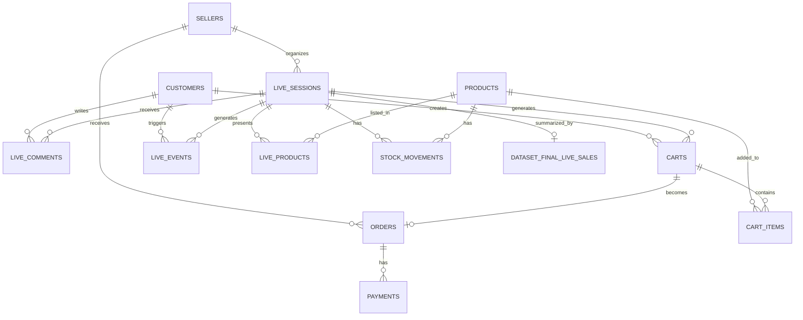

# Modélisation de la base de données — Bloc 1

## 1. Objectif

Cette étape a pour objectif de concevoir la base de données finale du projet **PayLive AI Copilot**.

Après les étapes de collecte, d’extraction, d’analyse qualité, de nettoyage, de normalisation et d’agrégation, les données sont prêtes à être stockées dans une base relationnelle.

La base de données doit permettre de stocker :

- les tables métiers nettoyées ;
- les relations entre les entités ;
- le dataset final agrégé pour l’IA ;
- les données utiles à la future API REST ;
- les informations nécessaires à l’analyse métier.

Cette étape prépare donc la création technique de la base et l’import des fichiers présents dans :

```text
data/processed/
```

## 2. Position dans le pipeline

Le pipeline du Bloc 1 est le suivant :

```text
1. Collecte et extraction multi-sources
2. Analyse qualité des données extraites
3. Nettoyage et normalisation
4. Agrégation finale du dataset IA
5. Modélisation de la base de données
6. Création de la base de données
7. Import des données préparées
8. Mise à disposition des données via API REST
```

La modélisation intervient donc après la préparation des données et avant la création/import dans le SGBD.

## 3. Choix du système de gestion de base de données

Le SGBD retenu pour le projet est :

```text
PostgreSQL
```

## 4. Justification du choix de PostgreSQL

PostgreSQL est adapté au projet pour plusieurs raisons :

- c’est un SGBD relationnel robuste ;
- il permet de gérer des clés primaires et étrangères ;
- il supporte les contraintes d’intégrité ;
- il gère correctement les types numériques, dates, timestamps et textes ;
- il est compatible avec Python ;
- il peut être utilisé avec FastAPI et SQLAlchemy pour la future API REST ;
- il est open source ;
- il est adapté à un projet de données structuré ;
- il permet de séparer les schémas métiers, analytiques et techniques.

Dans le projet, SQLite a déjà été utilisé pour simuler une ancienne base SQL source.  
PostgreSQL est utilisé ici comme base finale cible.

## 5. Nom de la base de données

La base finale du projet s’appelle :

```text
paylive_ai_copilot
```

## 6. Organisation logique de la base

La base sera organisée en trois schémas PostgreSQL :

```text
core
analytics
audit
```

## 6.1. Schéma `core`

Le schéma `core` contient les tables métiers nettoyées :

```text
core.sellers
core.customers
core.products
core.live_sessions
core.live_products
core.live_comments
core.carts
core.cart_items
core.orders
core.payments
core.stock_movements
core.live_events
```

Ces tables correspondent aux fichiers nettoyés produits par le script :

```text
src/data_processing/clean_and_standardize_data.py
```

## 6.2. Schéma `analytics`

Le schéma `analytics` contient le dataset final agrégé :

```text
analytics.dataset_final_live_sales
```

Cette table correspond au fichier :

```text
data/processed/dataset_final_live_sales.csv
```

Elle contient une ligne par session live et servira à la future partie IA.

## 6.3. Schéma `audit`

Le schéma `audit` contiendra les informations techniques d’import :

```text
audit.import_batches
audit.import_logs
```

Ces tables permettront de tracer les imports de données.

## 7. Données à importer

Les fichiers à importer dans PostgreSQL sont :

```text
data/processed/sellers_clean.csv
data/processed/customers_clean.csv
data/processed/products_clean.csv
data/processed/live_sessions_clean.csv
data/processed/live_products_clean.csv
data/processed/live_comments_clean.csv
data/processed/carts_clean.csv
data/processed/cart_items_clean.csv
data/processed/orders_clean.csv
data/processed/payments_clean.csv
data/processed/stock_movements_clean.csv
data/processed/live_events_clean.csv
data/processed/dataset_final_live_sales.csv
```

## 8. Modèle conceptuel des données — MCD

Le modèle conceptuel décrit les entités principales du projet et leurs associations.

## 8.1. Entités principales

Les entités principales sont :

```text
VENDEUR
CLIENT
PRODUIT
SESSION_LIVE
PRODUIT_LIVE
COMMENTAIRE_LIVE
PANIER
LIGNE_PANIER
COMMANDE
PAIEMENT
MOUVEMENT_STOCK
EVENEMENT_LIVE
DATASET_FINAL_LIVE_SALES
```

## 8.2. Description des entités

### VENDEUR

Un vendeur représente une boutique ou un créateur qui organise des lives de vente.

Attributs principaux :

```text
seller_id
shop_name
owner_first_name
owner_last_name
email
phone_number
country
main_platform
seller_status
created_at
```

### CLIENT

Un client représente un utilisateur qui interagit avec un live.

Attributs principaux :

```text
customer_id
username
platform
email
country
created_at
```

### PRODUIT

Un produit représente un article pouvant être vendu pendant un live.

Attributs principaux :

```text
product_id
product_name
category
brand
description
unit_price
stock_quantity
product_status
source
created_at
```

### SESSION_LIVE

Une session live représente un événement de vente en direct.

Attributs principaux :

```text
live_id
seller_id
platform
live_title
scheduled_start_at
actual_start_at
ended_at
live_status
peak_viewers
currency
created_at
```

### PRODUIT_LIVE

Cette entité représente l’association entre un live et les produits présentés pendant ce live.

Attributs principaux :

```text
live_product_id
live_id
product_id
display_order
special_live_price
initial_stock
remaining_stock
```

### COMMENTAIRE_LIVE

Un commentaire live représente un message envoyé par un client pendant une session live.

Attributs principaux :

```text
comment_id
live_id
customer_id
platform
username
comment_text
commented_at
comment_language
manual_intent_label
extracted_product_keyword
```

### PANIER

Un panier représente une intention d’achat créée pendant un live.

Attributs principaux :

```text
cart_id
live_id
customer_id
cart_status
created_at
updated_at
total_amount
currency
```

### LIGNE_PANIER

Une ligne de panier représente un produit ajouté à un panier.

Attributs principaux :

```text
cart_item_id
cart_id
product_id
quantity
unit_price
line_total
selected_size
selected_color
```

### COMMANDE

Une commande représente la validation commerciale d’un panier.

Attributs principaux :

```text
order_id
cart_id
customer_id
seller_id
order_status
order_amount
currency
created_at
confirmed_at
```

### PAIEMENT

Un paiement représente une tentative ou une réussite de paiement liée à une commande.

Attributs principaux :

```text
payment_id
order_id
payment_provider
payment_status
payment_amount
currency
payment_method
paid_at
transaction_reference
```

### MOUVEMENT_STOCK

Un mouvement de stock représente une évolution du stock d’un produit.

Attributs principaux :

```text
stock_movement_id
product_id
live_id
movement_type
quantity_change
movement_reason
created_at
```

### EVENEMENT_LIVE

Un événement live représente un log comportemental ou technique généré pendant un live.

Attributs principaux :

```text
event_id
live_id
customer_id
event_type
event_timestamp
event_value
source_system
```

### DATASET_FINAL_LIVE_SALES

Cette entité représente le dataset agrégé final, prêt pour la future partie IA.

Attributs principaux :

```text
live_id
seller_id
platform
live_date
peak_viewers
total_comments
total_carts
total_orders
total_revenue
payment_success_rate
conversion_rate
top_product_category
final_dataset_status
```

## 9. Associations du MCD

## 9.1. VENDEUR — SESSION_LIVE

Un vendeur peut organiser plusieurs lives.

Cardinalités :

```text
VENDEUR (1,1) ---- organise ---- (0,N) SESSION_LIVE
```

Règle :

```text
Une session live appartient à un seul vendeur.
Un vendeur peut organiser zéro, un ou plusieurs lives.
```

## 9.2. SESSION_LIVE — PRODUIT

Un live peut présenter plusieurs produits.  
Un produit peut être présenté dans plusieurs lives.

Cette relation est portée par l’entité associative :

```text
PRODUIT_LIVE
```

Cardinalités :

```text
SESSION_LIVE (1,1) ---- contient ---- (0,N) PRODUIT_LIVE
PRODUIT (1,1) ---- est présenté dans ---- (0,N) PRODUIT_LIVE
```

## 9.3. SESSION_LIVE — COMMENTAIRE_LIVE

Un live peut recevoir plusieurs commentaires.

Cardinalités :

```text
SESSION_LIVE (1,1) ---- reçoit ---- (0,N) COMMENTAIRE_LIVE
```

## 9.4. CLIENT — COMMENTAIRE_LIVE

Un client peut écrire plusieurs commentaires.

Cardinalités :

```text
CLIENT (1,1) ---- écrit ---- (0,N) COMMENTAIRE_LIVE
```

## 9.5. SESSION_LIVE — PANIER

Un live peut générer plusieurs paniers.

Cardinalités :

```text
SESSION_LIVE (1,1) ---- génère ---- (0,N) PANIER
```

## 9.6. CLIENT — PANIER

Un client peut créer plusieurs paniers.

Cardinalités :

```text
CLIENT (1,1) ---- crée ---- (0,N) PANIER
```

## 9.7. PANIER — LIGNE_PANIER

Un panier contient une ou plusieurs lignes de panier.

Cardinalités :

```text
PANIER (1,1) ---- contient ---- (1,N) LIGNE_PANIER
```

## 9.8. PRODUIT — LIGNE_PANIER

Un produit peut apparaître dans plusieurs lignes de panier.

Cardinalités :

```text
PRODUIT (1,1) ---- est ajouté dans ---- (0,N) LIGNE_PANIER
```

## 9.9. PANIER — COMMANDE

Un panier peut donner lieu à une commande.

Cardinalités :

```text
PANIER (1,1) ---- donne lieu à ---- (0,1) COMMANDE
```

## 9.10. COMMANDE — PAIEMENT

Une commande peut avoir zéro, un ou plusieurs paiements.

Cardinalités :

```text
COMMANDE (1,1) ---- possède ---- (0,N) PAIEMENT
```

## 9.11. PRODUIT — MOUVEMENT_STOCK

Un produit peut avoir plusieurs mouvements de stock.

Cardinalités :

```text
PRODUIT (1,1) ---- possède ---- (0,N) MOUVEMENT_STOCK
```

## 9.12. SESSION_LIVE — MOUVEMENT_STOCK

Un mouvement de stock peut être lié à un live.

Cardinalités :

```text
SESSION_LIVE (0,1) ---- est lié à ---- (0,N) MOUVEMENT_STOCK
```

## 9.13. SESSION_LIVE — EVENEMENT_LIVE

Un live peut générer plusieurs événements.

Cardinalités :

```text
SESSION_LIVE (1,1) ---- génère ---- (0,N) EVENEMENT_LIVE
```

## 9.14. CLIENT — EVENEMENT_LIVE

Un événement peut être associé à un client.

Cardinalités :

```text
CLIENT (0,1) ---- déclenche ---- (0,N) EVENEMENT_LIVE
```

## 9.15. SESSION_LIVE — DATASET_FINAL_LIVE_SALES

Le dataset final contient une ligne agrégée par live.

Cardinalités :

```text
SESSION_LIVE (1,1) ---- est résumé par ---- (0,1) DATASET_FINAL_LIVE_SALES
```

## 10. Représentation simplifiée du MCD

```text
VENDEUR
  1,N SESSION_LIVE
        1,N COMMENTAIRE_LIVE N,1 CLIENT
        1,N PANIER N,1 CLIENT
              1,N LIGNE_PANIER N,1 PRODUIT
              0,1 COMMANDE
                    0,N PAIEMENT
        1,N PRODUIT_LIVE N,1 PRODUIT
        0,N EVENEMENT_LIVE N,0 CLIENT
        0,N MOUVEMENT_STOCK N,1 PRODUIT
        0,1 DATASET_FINAL_LIVE_SALES
```

## 11. Modèle logique des données — MLD

Le MLD transforme le MCD en tables relationnelles.

## 11.1. Table `sellers`

```text
sellers(
    seller_id PK,
    shop_name,
    owner_first_name,
    owner_last_name,
    email,
    phone_number,
    country,
    main_platform,
    seller_status,
    created_at,
    cleaned_at,
    data_quality_status
)
```

## 11.2. Table `customers`

```text
customers(
    customer_id PK,
    username,
    platform,
    email,
    country,
    created_at,
    cleaned_at,
    data_quality_status
)
```

## 11.3. Table `products`

```text
products(
    product_id PK,
    product_name,
    category,
    brand,
    description,
    unit_price,
    stock_quantity,
    product_status,
    source,
    created_at,
    cleaned_at,
    data_quality_status
)
```

## 11.4. Table `live_sessions`

```text
live_sessions(
    live_id PK,
    seller_id FK -> sellers.seller_id,
    platform,
    live_title,
    scheduled_start_at,
    actual_start_at,
    ended_at,
    live_status,
    peak_viewers,
    currency,
    created_at,
    cleaned_at,
    data_quality_status
)
```

## 11.5. Table `live_products`

```text
live_products(
    live_product_id PK,
    live_id FK -> live_sessions.live_id,
    product_id FK -> products.product_id,
    display_order,
    special_live_price,
    initial_stock,
    remaining_stock,
    cleaned_at,
    data_quality_status
)
```

## 11.6. Table `live_comments`

```text
live_comments(
    comment_id PK,
    live_id FK -> live_sessions.live_id,
    customer_id FK -> customers.customer_id,
    platform,
    username,
    comment_text,
    commented_at,
    comment_language,
    manual_intent_label,
    extracted_product_keyword,
    cleaned_at,
    data_quality_status
)
```

## 11.7. Table `carts`

```text
carts(
    cart_id PK,
    live_id FK -> live_sessions.live_id,
    customer_id FK -> customers.customer_id,
    cart_status,
    created_at,
    updated_at,
    total_amount,
    currency,
    cleaned_at,
    data_quality_status
)
```

## 11.8. Table `cart_items`

```text
cart_items(
    cart_item_id PK,
    cart_id FK -> carts.cart_id,
    product_id FK -> products.product_id,
    quantity,
    unit_price,
    line_total,
    selected_size,
    selected_color,
    cleaned_at,
    data_quality_status
)
```

## 11.9. Table `orders`

```text
orders(
    order_id PK,
    cart_id FK -> carts.cart_id,
    customer_id FK -> customers.customer_id,
    seller_id FK -> sellers.seller_id,
    order_status,
    order_amount,
    currency,
    created_at,
    confirmed_at,
    cleaned_at,
    data_quality_status
)
```

## 11.10. Table `payments`

```text
payments(
    payment_id PK,
    order_id FK -> orders.order_id,
    payment_provider,
    payment_status,
    payment_amount,
    currency,
    payment_method,
    paid_at,
    transaction_reference,
    cleaned_at,
    data_quality_status
)
```

## 11.11. Table `stock_movements`

```text
stock_movements(
    stock_movement_id PK,
    product_id FK -> products.product_id,
    live_id FK -> live_sessions.live_id,
    movement_type,
    quantity_change,
    movement_reason,
    created_at,
    cleaned_at,
    data_quality_status
)
```

## 11.12. Table `live_events`

```text
live_events(
    event_id PK,
    live_id FK -> live_sessions.live_id,
    customer_id FK -> customers.customer_id,
    event_type,
    event_timestamp,
    event_value,
    source_system,
    cleaned_at,
    data_quality_status
)
```

## 11.13. Table `dataset_final_live_sales`

```text
dataset_final_live_sales(
    live_id PK,
    seller_id FK -> sellers.seller_id,
    shop_name,
    seller_country,
    main_platform,
    seller_status,
    platform,
    live_title,
    live_status,
    live_date,
    peak_viewers,
    currency,
    total_comments,
    purchase_intent_comments,
    total_carts,
    paid_carts,
    abandoned_carts,
    total_orders,
    total_payments,
    successful_payments,
    total_revenue,
    payment_success_rate,
    conversion_rate,
    revenue_per_viewer,
    top_product_category,
    total_events,
    api_error_events,
    final_dataset_created_at,
    final_dataset_status
)
```

## 12. Modèle physique des données — MPD PostgreSQL

Le MPD sera implémenté en PostgreSQL avec les choix suivants :

## 12.1. Types utilisés

```text
TEXT              pour les identifiants et textes longs
VARCHAR(n)        pour les champs courts contrôlés
INTEGER           pour les quantités et compteurs
NUMERIC(12,2)     pour les montants financiers
NUMERIC(10,4)     pour les ratios
DATE              pour les dates simples
TIMESTAMP         pour les dates avec heure
```

## 12.2. Contraintes principales

Les contraintes prévues sont :

- clés primaires sur tous les identifiants ;
- clés étrangères entre les tables ;
- contraintes `NOT NULL` sur les identifiants obligatoires ;
- contraintes `CHECK` sur les statuts ;
- contraintes `CHECK` sur les montants positifs ;
- contraintes `CHECK` sur les ratios compris entre 0 et 1 quand nécessaire ;
- index sur les colonnes de jointure ;
- index sur les dates principales.

## 13. Contraintes de validation métier

## 13.1. Plateformes autorisées

```text
tiktok
instagram
facebook_live
youtube_live
other
```

## 13.2. Statuts vendeurs autorisés

```text
active
inactive
suspended
```

## 13.3. Statuts produits autorisés

```text
active
inactive
out_of_stock
```

## 13.4. Statuts de live autorisés

```text
scheduled
live
ended
cancelled
```

## 13.5. Statuts de panier autorisés

```text
open
paid
abandoned
cancelled
```

## 13.6. Statuts de commande autorisés

```text
pending
confirmed
paid
cancelled
refunded
```

## 13.7. Statuts de paiement autorisés

```text
pending
succeeded
failed
cancelled
refunded
```

## 13.8. Types d’événements autorisés

```text
comment_sent
cart_opened
payment_clicked
payment_succeeded
api_error
product_viewed
```

## 13.9. Devises autorisées

```text
EUR
USD
GBP
CAD
CHF
```

## 14. Index prévus

Les index prévus sont :

```text
idx_live_sessions_seller_id
idx_live_sessions_platform
idx_live_sessions_actual_start_at
idx_live_products_live_id
idx_live_products_product_id
idx_live_comments_live_id
idx_live_comments_customer_id
idx_carts_live_id
idx_carts_customer_id
idx_cart_items_cart_id
idx_cart_items_product_id
idx_orders_cart_id
idx_orders_customer_id
idx_orders_seller_id
idx_payments_order_id
idx_stock_movements_product_id
idx_stock_movements_live_id
idx_live_events_live_id
idx_live_events_customer_id
idx_live_events_event_type
idx_dataset_final_live_sales_seller_id
idx_dataset_final_live_sales_platform
idx_dataset_final_live_sales_live_date
```

Ces index permettront d’optimiser :

- les jointures ;
- les filtres par vendeur ;
- les filtres par live ;
- les filtres par plateforme ;
- les filtres par date ;
- les futurs endpoints de l’API REST.

## 15. Stratégie d’import

Les données seront importées depuis les fichiers CSV nettoyés.

L’ordre d’import devra respecter les dépendances entre tables.

## 15.1. Ordre d’import prévu

```text
1. sellers
2. customers
3. products
4. live_sessions
5. live_products
6. live_comments
7. carts
8. cart_items
9. orders
10. payments
11. stock_movements
12. live_events
13. dataset_final_live_sales
```

Cet ordre permet de créer d’abord les tables référencées par des clés étrangères.

## 15.2. Script d’import prévu

Le script Python prévu sera :

```text
src/database/import_processed_data.py
```

Il devra :

- se connecter à PostgreSQL ;
- lire les fichiers CSV dans `data/processed/` ;
- vider les tables si nécessaire ;
- importer les données dans le bon ordre ;
- gérer les erreurs ;
- journaliser l’import ;
- produire un rapport d’import.

## 15.3. Rapports d’import prévus

Le script d’import générera :

```text
data/processed/database_import_report.csv
logs/import_processed_data.log
```

Le rapport contiendra :

```text
table_name
source_file
rows_read
rows_inserted
status
error_message
imported_at
```

## 16. Prise en compte RGPD

Les données utilisées dans ce projet sont simulées.

Aucune donnée réelle de PayLive n’est utilisée.

Cependant, la modélisation prend en compte les principes RGPD suivants :

- minimisation des données ;
- limitation des données personnelles dans le dataset final ;
- séparation entre tables métiers et dataset analytique ;
- absence de données bancaires réelles ;
- traçabilité des traitements ;
- possibilité de suppression ou d’anonymisation future ;
- documentation du registre de traitement.

## 17. Données personnelles présentes

Les tables contenant potentiellement des données personnelles sont :

```text
sellers
customers
live_comments
payments
```

## 17.1. Table `sellers`

Données personnelles potentielles :

```text
owner_first_name
owner_last_name
email
phone_number
```

Ces données sont fictives dans le projet.

## 17.2. Table `customers`

Données personnelles potentielles :

```text
username
email
country
```

Ces données sont fictives ou pseudonymisées.

## 17.3. Table `live_comments`

Données personnelles potentielles :

```text
username
comment_text
```

Les commentaires peuvent contenir du texte utilisateur.  
Dans ce projet, ils sont simulés.

## 17.4. Table `payments`

Données sensibles potentielles :

```text
transaction_reference
payment_method
```

Aucune donnée bancaire réelle n’est stockée.  
Les références de transaction sont fictives.

## 18. Minimisation dans le dataset final

Le dataset final :

```text
analytics.dataset_final_live_sales
```

ne contient pas les emails, les numéros de téléphone, les commentaires détaillés ou les références de transaction.

Il contient uniquement des indicateurs agrégés par live.

Cette approche réduit les risques liés aux données personnelles.

## 19. Séparation des usages

La base sépare deux usages :

```text
core       = données métiers propres
analytics  = dataset agrégé pour IA et analyse
audit      = traces techniques d’import
```

Cette séparation permet de limiter les accès selon les besoins.

Par exemple :

- une API métier peut accéder aux tables `core` ;
- un modèle IA peut accéder principalement à `analytics.dataset_final_live_sales` ;
- les logs d’import restent dans `audit`.

## 20. Règles d’accès prévues

Les accès seront gérés progressivement.

Règles prévues :

```text
admin_db       accès complet
api_user       accès lecture contrôlée aux données nécessaires à l’API
analytics_user accès lecture au schéma analytics
```

Le compte utilisé par l’API ne devra pas avoir de droits d’administration.

## 21. Tables prévues par schéma

## 21.1. Schéma `core`

```text
core.sellers
core.customers
core.products
core.live_sessions
core.live_products
core.live_comments
core.carts
core.cart_items
core.orders
core.payments
core.stock_movements
core.live_events
```

## 21.2. Schéma `analytics`

```text
analytics.dataset_final_live_sales
```

## 21.3. Schéma `audit`

```text
audit.import_batches
audit.import_logs
```

## 22. Diagramme relationnel simplifié



## 23. Cohérence avec les fichiers préparés

La modélisation s’appuie sur les fichiers propres générés précédemment.

Chaque table `core` correspond à un fichier `*_clean.csv`.

La table `analytics.dataset_final_live_sales` correspond au fichier agrégé :

```text
dataset_final_live_sales.csv
```

Cette cohérence permet un import simple et reproductible.

## 24. Prochaine étape technique

Après cette modélisation, les fichiers SQL suivants seront créés :

```text
sql/01_create_database.sql
sql/02_create_schemas.sql
sql/03_create_tables.sql
sql/04_create_indexes.sql
```

Ensuite, le script d’import suivant sera développé :

```text
src/database/import_processed_data.py
```

## 25. Conclusion

La modélisation de la base de données permet de préparer le stockage structuré des données du projet PayLive AI Copilot.

Elle définit :

- les entités métiers ;
- les associations ;
- les clés primaires ;
- les clés étrangères ;
- les contraintes ;
- les schémas PostgreSQL ;
- la stratégie d’import ;
- les règles RGPD ;
- le dataset analytique final.

Cette étape prépare la création effective de la base PostgreSQL et l’import des fichiers nettoyés et agrégés.